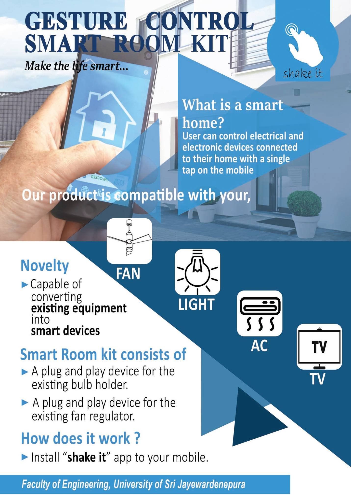
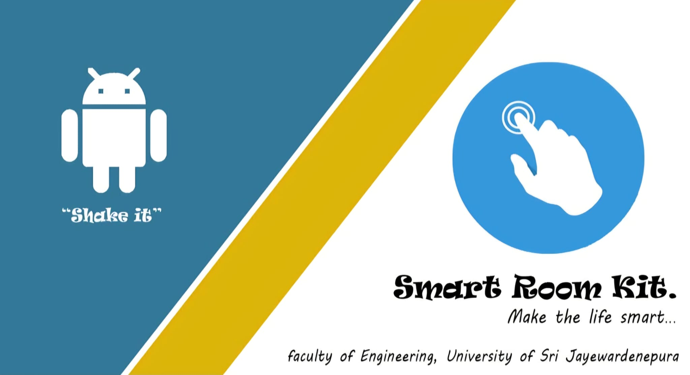

# Gesture Control Smart Room Kit

*Make the life smart...*

A plug-and-play smart home kit that converts ordinary electrical appliances
into gesture- and voice-controlled smart devices — built for the Sri Lankan
market, where smart home systems were still either unavailable or priced out
of reach for most households.

Developed by an 8-member undergraduate team at the Department of Electrical
and Electronics Engineering, Faculty of Engineering, University of Sri
Jayewardenepura (2018–2019).

**Placed 7th at the Innovation, Invention, and Venture Creation Council
(IIVCC) Competition** under the Robotics and Embedded Systems category.
Also exhibited at the university-level **Innovate** competition and the
national **Sri Lanka Inventors Commission** exhibition.



---

## The problem

Smart home systems available internationally require replacing existing
appliances with purpose-built smart versions — expensive, wasteful, and
impractical for a market like Sri Lanka. Our approach was different: keep
the appliances you already own, and add a small WiFi-controlled adapter
that makes them smart without any re-wiring.

## What it controls

| Appliance | How |
|---|---|
| Light bulbs | Smart Holder — plug-and-play replacement for the existing bulb socket |
| Ceiling/pedestal fan | Smart Regulator — plug-and-play replacement for the existing fan regulator |
| TV | Smart IR Converter — emits IR codes to the existing TV |
| AC | Smart IR Converter — emits IR codes to the existing AC unit |

## How it works

```
Phone (Shake it app)
  ├── Gesture (shake/accelerometer)  ─┐
  ├── Voice command                   ├─── WiFi ──► Arduino NANO + Relay Modules ──► Lights / Fan
  └── Manual key input               ─┘
                                           └──► Smart IR Converter ──► TV / AC
```

1. User installs the **"Shake it"** Android app on their phone.
2. The app reads the phone's built-in accelerometer — a shake gesture triggers
   a command; voice and manual key inputs are also supported.
3. The command is sent over WiFi to an Arduino NANO with a WiFi module.
4. For lights and the fan: the Arduino drives relay modules wired into the
   Smart Holder and Smart Regulator.
5. For TV and AC: the Arduino drives the Smart IR Converter, which replays
   the appliance's own IR remote codes — no changes to the appliance needed.

## Hardware

| Component | Qty | Purpose |
|---|---|---|
| Arduino NANO | 1 | Central controller |
| WiFi Module | 4 | WiFi communication |
| Relay Module | 4 | Switching for lights and fan |
| Fan Regulator | 1 | Smart fan speed control |

Total component cost at time of build: approximately Rs. 6,400 (~$20 USD).

## Mobile app: "Shake it" (Android)



Three input modes, all routing to the same WiFi backend:

- **Gesture** — phone accelerometer detects a shake; different shake patterns
  map to different appliances
- **Voice** — spoken commands parsed on-device
- **Key input** — on-screen buttons for manual control

The app also supports remote mapping of IR codes for new TV/AC models.

## Key features

- **Plug and Play** — no re-wiring, no technical knowledge required
- **Works with existing appliances** — no need to replace anything
- **Accessible** — gesture and voice modes make it usable by people with
  visual or hearing impairments
- **Low cost** — designed specifically to be affordable for the Sri Lankan
  domestic market
- **Scalable** — the same architecture can extend to any IR-controlled or
  relay-switched appliance

## Recognition

- **7th place** — Innovation, Invention, and Venture Creation Council
  (IIVCC) Competition, Robotics and Embedded Systems category
- Exhibited at **Innovate** (Faculty of Engineering, University of Sri
  Jayewardenepura)
- Exhibited at the **Sri Lanka Inventors Commission** national exhibition

## Source code

The original firmware (Arduino NANO) and Android app source were not
preserved after the project concluded. This repository documents the
hardware architecture, system design, and exhibition results.
